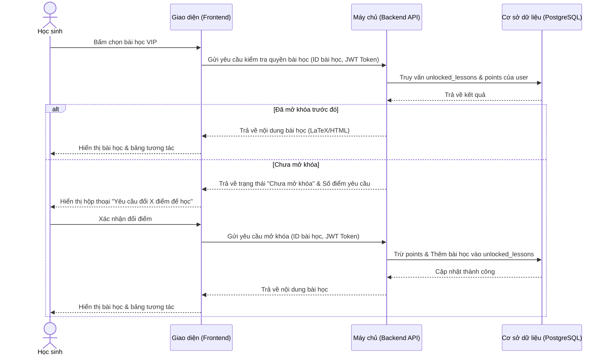
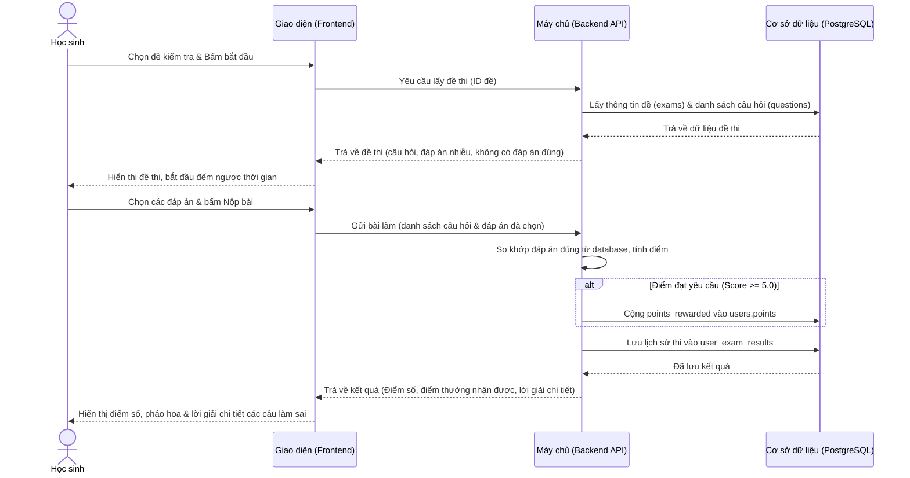
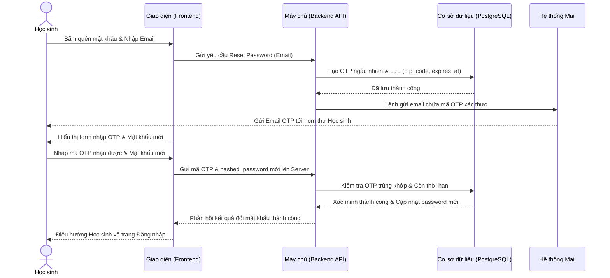
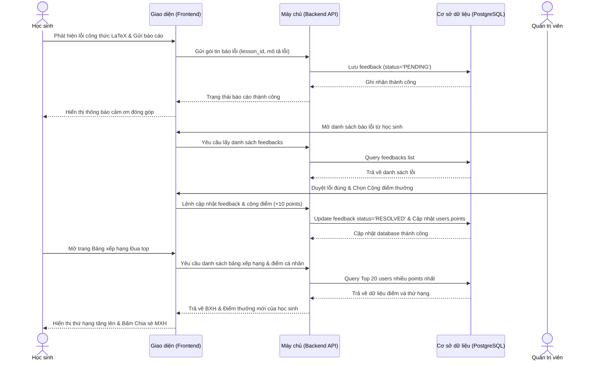
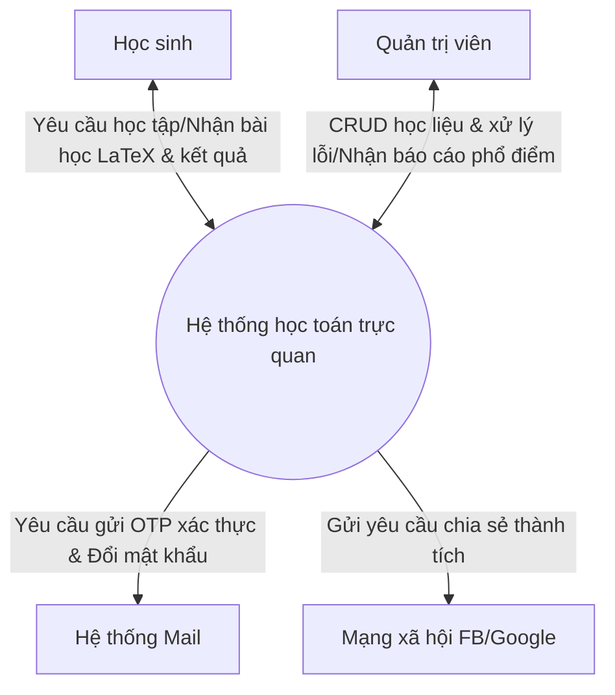
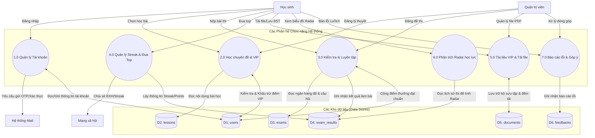
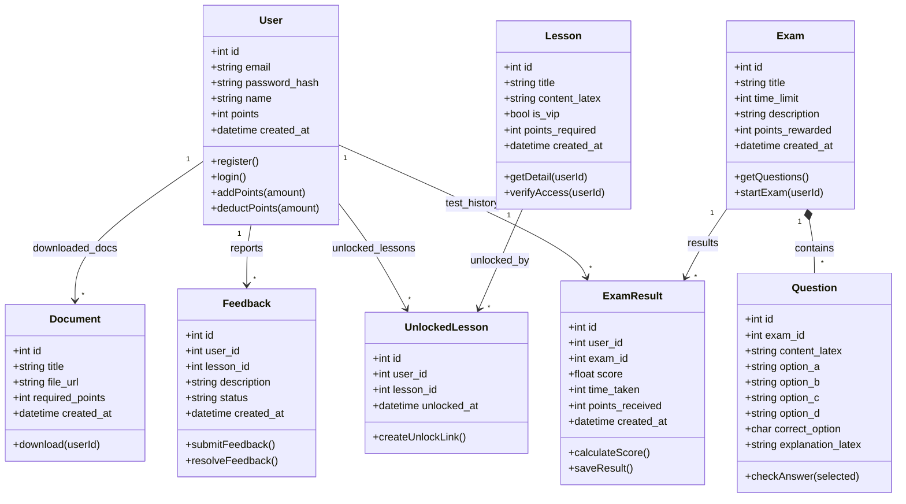

# PHÂN TÍCH CHỨC NĂNG & THIẾT KẾ CƠ SỞ DỮ LIỆU HỆ THỐNG HỌC TOÁN TRỰC QUAN THPT

---

## I. PHÂN TÍCH CHUYÊN SÂU CÁC NỀN TẢNG HỌC TOÁN TRỰC TUYẾN TRONG VÀ NGOÀI NƯỚC

Để thiết kế một website học toán trực quan và hiệu quả, chúng ta tiến hành khảo sát, phân tích chi tiết toàn diện cấu trúc chức năng, phương pháp tiếp cận sư phạm và trải nghiệm người dùng (UX) của 3 nền tảng giáo dục toán học hàng đầu trong và ngoài nước hiện nay: **HOCMAI (hocmai.vn)**, **Tuyensinh247 (tuyensinh247.com)** và **Brilliant (brilliant.org)**.

---

### 1. Nền tảng HOCMAI (hocmai.vn)
* **Tổng quan:** HOCMAI là hệ thống giáo dục trực tuyến lâu đời và có quy mô lớn nhất Việt Nam, sở hữu cơ sở dữ liệu khóa học đồ sộ từ cấp Tiểu học đến ôn thi Tốt nghiệp THPT Quốc gia & Đại học.
* **Lộ trình học tập & Luyện thi môn Toán:**
  * **Giải pháp luyện thi PEN truyền thống:** Chia lộ trình ôn thi THPT Quốc gia làm 3 giai đoạn rõ ràng:
    * *PEN-C (Ôn luyện kiến thức toàn diện):* Hệ thống hóa toàn bộ kiến thức giáo khoa lớp 10, 11 và trọng tâm lớp 12 bằng video lý thuyết bài bản.
    * *PEN-I (Luyện đề chuyên sâu):* Cung cấp các đề thi thử chuẩn cấu trúc đề minh họa của Bộ GD&ĐT, rèn kỹ năng nhận diện và giải toán trắc nghiệm nhanh.
    * *PEN-M (Ôn tập cấp tốc):* Hệ thống các mẹo loại trừ phương án sai, mẹo bấm máy tính Casio và tổng ôn kiến thức sát ngày thi.
  * **Chương trình HOCMAI Topclass (Chương trình GDPT mới 2018):** 
    * HOCMAI đã chuyển dịch mạnh mẽ sang chương trình mới lớp 10, 11, 12 bám sát 3 bộ sách giáo khoa (Cánh Diều, Kết nối tri thức, Chân trời sáng tạo).
    * Áp dụng quy trình khép kín 4 bước: **HỌC - HỎI - LUYỆN - KIỂM TRA**.
* **Các tính năng kỹ thuật và tương tác cốt lõi:**
  * **Trình phát Video học tập nâng cao:** Giao diện xem video tích hợp công cụ thay đổi tốc độ phát (0.75x đến 2x), ghi chú trực tiếp mốc thời gian bài học (Video Bookmarking), và danh sách bài học/tài liệu PDF đính kèm hiển thị trực quan ngay cạnh video.
  * **Trợ lý học tập AI (IChat):** Tích hợp chatbot AI hỗ trợ 24/7. Trợ lý này giúp định nghĩa lại công thức, giải thích nhanh lý thuyết toán học cơ bản và gợi ý link bài học liên quan khi học sinh yêu cầu.
  * **Cơ chế Hỏi đáp (Q&A Forum):** Dưới mỗi bài giảng, HOCMAI xây dựng một box bình luận chuyên biệt. Học sinh có thể gửi câu hỏi kèm hình ảnh chụp bài tập. Đội ngũ Mentor (các sinh viên xuất sắc/trợ giảng chuyên môn) cam kết trả lời và hướng dẫn giải bài trong vòng 30 phút.
  * **Phòng thi thử & Đánh giá năng lực:** Phát triển phân hệ thi online độc lập hỗ trợ luyện đề thi Tốt nghiệp THPT, kỳ thi Đánh giá năng lực (HSA của ĐHQGHN, APT của ĐHQG-HCM) và Đánh giá tư duy (TSA của ĐHBK Hà Nội).
* **Ưu điểm:** Hệ thống bài học cực kỳ đồ sộ, lộ trình khoa học, thương hiệu uy tín, có trợ lý AI hỗ trợ giải đáp lý thuyết nhanh.
* **Nhược điểm:** Mặc dù bài học chất lượng nhưng tính trực quan động (Interactive visual tools) còn kém. Học sinh học tập một chiều qua video tĩnh, thiếu các công cụ tương tác trực tiếp (ví dụ: kéo thả tham số để nhìn đồ thị thay đổi thời gian thực).

---

### 2. Nền tảng Tuyensinh247 (tuyensinh247.com)
* **Tổng quan:** Là nền tảng học trực tuyến vô cùng được học sinh THPT ưa chuộng nhờ tốc độ cập nhật đề thi cực nhanh và kho lời giải chi tiết vô cùng chất lượng.
* **Lộ trình học tập & Luyện thi môn Toán:**
  * **Lộ trình SUN:** Chia quá trình ôn luyện làm 3 bước:
    * *SUN 1 (Nền tảng):* Học sinh nắm vững lý thuyết và các dạng bài tập sách giáo khoa cơ bản.
    * *SUN 2 (Chuyên sâu):* Đi sâu vào các chuyên đề điểm 8, 9, 10 và các phương pháp giải nhanh trắc nghiệm bằng máy tính cầm tay (Casio).
    * *SUN 3 (Luyện đề):* Luyện đề thi thử của các trường THPT Chuyên và các Sở GD&ĐT trên cả nước.
  * **Mô hình học tập kết hợp:** Kết hợp bài giảng ghi hình sẵn chất lượng cao với các buổi học **Livestream tương tác trực tiếp** cùng giáo viên và thủ khoa để giải đáp trực tiếp thắc mắc.
* **Các tính năng kỹ thuật và tương tác cốt lõi:**
  * **Phòng thi thử Online mô phỏng thực tế:** Giao diện thi trắc nghiệm Toán bám sát trải nghiệm thi thật trên máy tính:
    * Bảng điều hướng câu hỏi (Question Navigation) hiển thị rõ các câu đã làm, chưa làm, hoặc đã đánh dấu xem lại.
    * Đồng hồ đếm ngược thời gian làm bài chính xác giây, tự động nộp bài khi hết giờ.
  * **Lời giải chi tiết tách biệt từng câu (Video & Text):** Sau khi học sinh bấm nộp bài, hệ thống hiển thị bảng điểm và cung cấp lời giải chi tiết cho từng câu:
    * *Lời giải Text:* Viết chi tiết các bước biến đổi công thức toán học sắc nét (hỗ trợ hiển thị LaTeX chuẩn).
    * *Lời giải Video ngắn (1 - 5 phút):* Điểm độc đáo nhất của Tuyensinh247 là mỗi câu hỏi khó trong đề thi đều có một video cắt ngắn riêng biệt do giáo viên chữa riêng cho câu đó. Học sinh không cần phải xem cả video giải đề dài 90 phút mà chỉ cần nhấp vào nút "Xem video chữa câu này" để xem giải thích trực tiếp.
  * **Diễn đàn Hỏi đáp 247 & Hoidap247.com:**
    * Tuyensinh247 cam kết giải đáp thắc mắc chuyên môn dưới mỗi câu hỏi của đề thi online trong vòng 10 - 30 phút bởi ban chuyên môn túc trực.
    * Nền tảng liên kết chặt chẽ với **Hoidap247.com** (nền tảng Q&A cộng đồng lớn nhất của cùng công ty chủ quản). Học sinh có thể chụp ảnh bài tập toán học bằng điện thoại, đăng lên diễn đàn và nhận lời giải đáp miễn phí trong vòng 5 - 10 phút từ các thành viên xuất sắc hoặc chuyên gia.
* **Ưu điểm:** Ngân hàng đề thi cực kỳ phong phú và cập nhật liên tục; lời giải chi tiết chất lượng cao (cả chữ LaTeX và video ngắn cho từng câu); hỗ trợ hỏi đáp nhanh chóng.
* **Nhược điểm:** Website tập trung nhiều vào tư duy "luyện đề thi thử" và học mẹo bấm máy tính Casio để đạt điểm số cao, ít tập trung vào việc khơi gợi tư duy toán học sâu sắc hoặc trực quan hóa các mô hình toán học (như vẽ đồ thị hàm số động, biến đổi hình học không gian).

---

### 3. Nền tảng Brilliant (brilliant.org)
* **Tổng quan:** Brilliant.org là nền tảng giáo dục quốc tế hàng đầu về Toán, Khoa học máy tính và Khoa học tự nhiên dựa trên phương pháp tự học tương tác chủ động (Active Learning). Nền tảng này loại bỏ hoàn toàn các video bài giảng truyền thống dài dòng, thay thế bằng các câu đố trực quan sinh động và công cụ mô phỏng động.
* **Lộ trình học tập & Phương pháp tiếp cận sư phạm:**
  * **Học tương tác chủ động (Active Learning):** Brilliant thúc đẩy tư duy trực giác của học sinh bằng cách đưa các thử thách thực hành trước, sau đó mới đúc kết công thức toán học. Phương pháp này giúp học sinh hiểu sâu bản chất vấn đề thay vì ghi nhớ máy móc.
  * **Lộ trình chia nhỏ (Bite-sized courses):** Các khóa học Toán THPT (Đại số, Hình học trực quan, Giải tích) được chia thành các bài học siêu nhỏ gồm các chuỗi câu đố tăng dần độ khó, giúp duy trì sự hào hứng và tránh cảm giác quá tải.
* **Các tính năng kỹ thuật và tương tác cốt lõi:**
  * **Widget mô phỏng tương tác thời gian thực (Interactive Visual Widgets):** Sử dụng các công cụ vẽ hình động (SVG, Canvas, WebGL). Học sinh có thể trực tiếp kéo giãn các đỉnh tam giác, xoay mô hình hình học 3D, hoặc kéo thanh trượt (slider) thay đổi tham số hàm số để xem đồ thị biến đổi ngay lập tức.
  * **Lời giải thích trực quan tức thời (Instant Visual Explanations):** Ngay sau khi người dùng nộp đáp án cho mỗi câu đố, hệ thống lập tức hiển thị phản hồi kèm hình minh họa động để làm rõ phương pháp giải toán về mặt hình ảnh và tư duy bản chất.
  * **Hệ thống duy trì thói quen học tập:** Sử dụng cơ chế Streak hàng ngày rất chặt chẽ, thử thách hàng ngày (Daily Challenges) được cá nhân hóa, bảng vàng thi đua để giữ chân học sinh học tập mỗi ngày.
* **Ưu điểm:** Khả năng trực quan hóa các khái niệm toán học trừu tượng xuất sắc; kích thích tư duy giải quyết vấn đề cực kỳ tốt; giao diện hiện đại và trải nghiệm tương tác động đẳng cấp thế giới.
* **Nhược điểm:** Chi phí sử dụng cao, không bám sát theo chương trình thi cử cụ thể của từng quốc gia (như cấu trúc đề thi Tốt nghiệp THPT Quốc gia tại Việt Nam).

---

### 4. Bài học kinh nghiệm áp dụng vào phát triển dự án
Từ việc phân tích HOCMAI, Tuyensinh247 và Brilliant.org, chúng ta rút ra các bài học thiết kế kỹ thuật và nghiệp vụ cốt lõi để tối ưu hóa sản phẩm:
1. **Thiết kế cấu trúc dữ liệu tối giản & khoa học:** Kế thừa cách tổ chức phân cấp khoa học của cả hai hệ thống: `Subjects (Môn học) -> Chapters (Chương) -> Lessons (Bài học)` và `Exams (Đề thi) -> Questions (Câu hỏi)`.
2. **Khắc phục triệt để nhược điểm "Học tĩnh" (Học hỏi từ Brilliant):** Tích hợp các thư viện vẽ đồ thị tương tác thời gian thực (như Function-plot/JSXGraph) ngay trong bài học. Học sinh có thể thay đổi các tham số (ví dụ: thay đổi $a, b, c$ trong hàm bậc hai $y = ax^2 + bx + c$ bằng slider kéo thả để nhìn đồ thị biến đổi trực tiếp).
3. **Hiển thị công thức toán học sắc nét bằng LaTeX:** Bắt buộc sử dụng thư viện **KaTeX** phía Client để render nhanh các biểu thức toán học trong cả nội dung lý thuyết, đề thi và lời giải chi tiết.
4. **Hệ thống hóa Lời giải chi tiết (Explanations):** Lưu trữ lời giải chi tiết dạng văn bản hỗ trợ LaTeX trong trường `explanation` của bảng `questions`. Cho phép học sinh xem lời giải ngay sau khi nộp bài thi để nâng cao hiệu quả tự ôn tập.
5. **Cơ chế tích lũy điểm thưởng & Trò chơi hóa (Gamification):** Học sinh kiếm điểm thưởng từ việc làm bài kiểm tra đạt kết quả tốt để mở khóa các bài học VIP hoặc tài liệu VIP. Tính năng theo dõi Streak học tập hàng ngày giúp thúc đẩy hành vi học tập chủ động và lặp lại của học sinh.
6. **Kênh phản hồi lỗi học liệu (Feedbacks):** Xây dựng tính năng gửi phản hồi giúp học sinh đóng góp ý kiến hoặc báo lỗi công thức, nội dung sai sót nhanh chóng để Admin kịp thời sửa đổi, đảm bảo độ chính xác tuyệt đối của nội dung toán học.

---

## II. DANH SÁCH CHỨC NĂNG HỆ THỐNG (TINH GỌN & TẬP TRUNG)

Để hệ thống hoạt động mượt mà, trực quan và tối ưu hiệu năng phát triển trên nền tảng Rust Backend, danh sách chức năng được tinh giản, tập trung vào trải nghiệm học tập cốt lõi của học sinh và quản lý của quản trị viên:

### 1. Phân hệ dành cho Học sinh
1. **Đăng ký/Đăng nhập:** Đăng ký tài khoản, đăng nhập hệ thống để lưu trữ tiến trình học tập, tích lũy điểm thưởng và theo dõi chuỗi ngày học liên tục (Streak).
2. **Theo dõi Streak học tập:** Ghi nhận và hiển thị số ngày học tập liên tục để khuyến khích tinh thần tự học hàng ngày.
3. **Trang cá nhân & Thống kê học lực:** Hiển thị thông tin học tập, điểm tích lũy, các bài học đã hoàn thành và biểu đồ phân tích điểm mạnh/điểm yếu (chương học cần cải thiện) dựa trên lịch sử làm bài kiểm tra.
4. **Học theo chuyên đề & Khối lớp:** Lọc nội dung theo Khối 10, 11, 12 và chọn chuyên đề học tập. Học sinh đọc lý thuyết trực quan (hỗ trợ công thức LaTeX sắc nét), dùng điểm tích lũy để mở khóa bài học VIP và đánh dấu hoàn thành bài học.
5. **Làm bài kiểm tra & Luyện tập:** Thực hiện các đề thi trắc nghiệm hoặc điền số có giới hạn thời gian. Hệ thống chấm điểm tự động, lưu lịch sử, hiển thị lời giải chi tiết ngay sau khi nộp bài và cộng điểm thưởng khi đạt yêu cầu.
6. **Quản lý Bộ sưu tập câu hỏi khó:** Lưu các câu hỏi khó/hay trong đề thi vào các bộ sưu tập do học sinh tự tạo để dễ dàng ôn tập lại sau.
7. **Tải tài liệu học tập:** Tìm kiếm và tải tài liệu PDF/Word. Các tài liệu VIP yêu cầu học sinh đổi bằng điểm tích lũy để mở khóa tải về.
8. **Đóng góp & Góp ý:** Gửi ý kiến phản hồi đóng góp, báo cáo lỗi công thức, nội dung lý thuyết bài học hoặc câu hỏi trắc nghiệm sai sót, báo lỗi hệ thống/giao diện.

### 2. Phân hệ dành cho Quản trị viên (Admin)
1. **Quản lý bài học & Chuyên đề (CRUD):** Thêm, sửa, xóa Khối lớp, Chuyên đề, Chương học và các bài học lý thuyết trực quan.
2. **Quản lý ngân hàng câu hỏi & Đề kiểm tra (CRUD):** Soạn thảo và quản lý ngân hàng câu hỏi, thiết lập độ khó (Dễ/Trung bình/Khó), tạo đề kiểm tra bằng cách lựa chọn các câu hỏi trong ngân hàng đề.
3. **Soạn thảo công thức toán học với LaTeX:** Soạn nội dung bài học, đề bài câu hỏi, các đáp án trắc nghiệm và lời giải chi tiết sử dụng ký pháp LaTeX hiển thị chuyên nghiệp.
4. **Quản lý tài liệu & Bài viết (CRUD):** Quản lý kho tài liệu tải về (cấu hình VIP/miễn phí, số điểm mở khóa) và biên soạn các bài viết chia sẻ kiến thức, tin tức toán học.
5. **Xem báo cáo phân tích học lực:** Xem thống kê điểm thi trung bình, tỷ lệ xếp loại học lực của toàn bộ học sinh trên hệ thống dưới dạng biểu đồ trực quan.
6. **Quản lý & xử lý ý kiến đóng góp:** Xem danh sách đóng góp từ học sinh, phê duyệt lỗi nội dung, ghi chú phản hồi giải quyết và cập nhật trạng thái xử lý góp ý.

---

## III. BIỂU ĐỒ USE CASE & LUỒNG NGHIỆP VỤ & LUỒNG DỮ LIỆU (DATA FLOW)

Dưới đây là đặc tả chi tiết Use Case (được thiết kế thành các file Draw.io tương ứng), các luồng nghiệp vụ Sequence Diagram, và Luồng Dữ Liệu (DFD).

### 1. Sơ đồ Use Case Tổng thể & Đặc tả Chi tiết

Hệ thống được thiết kế tối giản ở mức core nhưng cung cấp các tính năng sâu về toán học trực quan và xếp hạng thi đua. Dưới đây là sơ đồ đặc tả 3 cấp (Level 1, Level 2, Level 3) chi tiết thể hiện đầy đủ các mối quan hệ nghiệp vụ phức tạp.

* **File thiết kế Draw.io:** [uc_tong_the.drawio](file:///Users/vuphap/Tasks/web-hoc-toan/uc_tong_the.drawio)
* **Biểu đồ trực quan (Mermaid Use Case 3 cấp):**

```mermaid
graph TD
  HocSinh[Học sinh]
  Admin[Quản trị viên]

  subgraph "Hệ thống học toán trực quan THPT"
    %% Level 1: Core Use Cases (Student)
    UC_Auth(Đăng ký & Đăng nhập)
    UC_Study(Học chuyên đề & Bài học VIP)
    UC_Practice(Làm bài kiểm tra & Luyện tập)
    UC_Stats(Xem thống kê học lực & Streak)
    UC_Leaderboard(Xem bảng xếp hạng & Đua Top)
    UC_Download(Tải tài liệu học tập)
    UC_Feedback(Báo cáo lỗi & Đóng góp ý kiến)

    %% Level 1: Core Use Cases (Admin)
    UC_ManageCurriculum(Quản lý nội dung học tập)
    UC_ManageExams(Quản lý đề thi & Câu hỏi)
    UC_ManageDocs(Quản lý tài liệu & Tin tức)
    UC_AdminReports(Xem báo cáo & Góp ý)

    %% Level 2: Sub Use Cases (Student)
    UC_UnlockLesson(Mở khóa bài học VIP)
    UC_VisualTools(Sử dụng công cụ toán trực quan)
    UC_GradeExam(Chấm điểm & Nhận điểm thưởng)
    UC_Explain(Xem lời giải chi tiết LaTeX)
    UC_SaveQuestion(Lưu câu hỏi vào bộ sưu tập)
    UC_SaveStreak(Cứu Streak bằng điểm)
    UC_RadarChart(Phân tích biểu đồ Radar học lực)
    UC_TopStreak(Đua top Streak học tập)
    UC_TopPoints(Đua top Điểm tích lũy)
    UC_UnlockDoc(Mở khóa tài liệu VIP)
    UC_ReportLaTeX(Báo lỗi công thức LaTeX)
    UC_ReportInteractive(Báo lỗi mô phỏng tương tác)

    %% Level 2: Sub Use Cases (Admin)
    UC_LaTeX(Soạn thảo công thức LaTeX)
    UC_ConfigVIP(Cấu hình thuộc tính VIP bài học)
    UC_ResolveFeedback(Phản hồi lỗi & Góp ý)
    UC_ScoreStats(Thống kê phổ điểm hệ thống)

    %% Level 3: Sub-Sub Use Cases (Interactive Tools)
    UC_TrigCircle(Tương tác đường tròn lượng giác)
    UC_GraphPlot(Vẽ đồ thị hàm số tự động)
  end

  %% Associations (Level 1)
  HocSinh --> UC_Auth
  HocSinh --> UC_Study
  HocSinh --> UC_Practice
  HocSinh --> UC_Stats
  HocSinh --> UC_Leaderboard
  HocSinh --> UC_Download
  HocSinh --> UC_Feedback

  Admin --> UC_Auth
  Admin --> UC_ManageCurriculum
  Admin --> UC_ManageExams
  Admin --> UC_ManageDocs
  Admin --> UC_AdminReports

  %% Level 2 & 3 Relationships (Student)
  UC_UnlockLesson -.->|&lt;&lt;extend&gt;&gt;| UC_Study
  UC_VisualTools -.->|&lt;&lt;include&gt;&gt;| UC_Study
  
  UC_TrigCircle -.->|&lt;&lt;extend&gt;&gt;| UC_VisualTools
  UC_GraphPlot -.->|&lt;&lt;extend&gt;&gt;| UC_VisualTools

  UC_Practice -.->|&lt;&lt;include&gt;&gt;| UC_GradeExam
  UC_Explain -.->|&lt;&lt;extend&gt;&gt;| UC_Practice
  UC_SaveQuestion -.->|&lt;&lt;extend&gt;&gt;| UC_Practice

  UC_SaveStreak -.->|&lt;&lt;extend&gt;&gt;| UC_Stats
  UC_RadarChart -.->|&lt;&lt;include&gt;&gt;| UC_Stats

  UC_TopStreak -.->|&lt;&lt;extend&gt;&gt;| UC_Leaderboard
  UC_TopPoints -.->|&lt;&lt;extend&gt;&gt;| UC_Leaderboard

  UC_UnlockDoc -.->|&lt;&lt;extend&gt;&gt;| UC_Download

  UC_ReportLaTeX -.->|&lt;&lt;extend&gt;&gt;| UC_Feedback
  UC_ReportInteractive -.->|&lt;&lt;extend&gt;&gt;| UC_Feedback

  %% Level 2 Relationships (Admin)
  UC_ManageCurriculum -.->|&lt;&lt;include&gt;&gt;| UC_LaTeX
  UC_ManageCurriculum -.->|&lt;&lt;include&gt;&gt;| UC_ConfigVIP
  UC_ManageExams -.->|&lt;&lt;include&gt;&gt;| UC_LaTeX

  UC_ResolveFeedback -.->|&lt;&lt;extend&gt;&gt;| UC_AdminReports
  UC_AdminReports -.->|&lt;&lt;include&gt;&gt;| UC_ScoreStats
```



---

#### 1.1 Đặc tả Use Case: Đăng ký & Đăng nhập
* **File thiết kế Draw.io:** [uc_tong_the.drawio](file:///Users/vuphap/Tasks/web-hoc-toan/uc_tong_the.drawio)
* **Tóm tắt đặc tả:**
  * **Tác nhân:** Học sinh, Quản trị viên.
  * **Tiền điều kiện:** Người dùng chưa đăng nhập vào hệ thống.
  * **Hậu điều kiện:** Người dùng truy cập thành công, hệ thống cấp JWT Token.
  * **Luồng sự kiện chính:**
    1. Người dùng gửi thông tin đăng ký (email, username, mật khẩu).
    2. Backend băm mật khẩu bảo mật (bcrypt/argon2) và lưu vào bảng `users`.
    3. Người dùng đăng nhập, Backend kiểm tra mật khẩu khớp và trả về JWT Token lưu ở LocalStorage.

---

#### 1.2 Đặc tả Use Case: Học chuyên đề & Bài học VIP
* **File thiết kế Draw.io:** [uc_tong_the.drawio](file:///Users/vuphap/Tasks/web-hoc-toan/uc_tong_the.drawio)
* **Tóm tắt đặc tả:**
  * **Tác nhân:** Học sinh.
  * **Mối quan hệ:**
    * Được mở rộng (`<<extend>>`) bởi ca sử dụng cấp 2: **Mở khóa bài học VIP** (chỉ kích hoạt khi chọn bài học VIP).
    * Bắt buộc bao gồm (`<<include>>`) ca sử dụng cấp 2: **Sử dụng công cụ toán trực quan**.
    * Ca sử dụng **Sử dụng công cụ toán trực quan** được mở rộng (`<<extend>>`) bởi các ca sử dụng cấp 3: **Tương tác đường tròn lượng giác** và **Vẽ đồ thị hàm số tự động**.
  * **Tiền điều kiện:** Học sinh đã đăng nhập thành công.
  * **Hậu điều kiện:** Truy cập nội dung bài học lý thuyết hoặc mở khóa bài học VIP (trừ điểm) thành công.
  * **Luồng sự kiện chính:**
    1. Học sinh chọn Khối lớp và Chuyên đề học tập.
    2. Nếu bài học là VIP và chưa mở khóa, hệ thống kích hoạt ca sử dụng **Mở khóa bài học VIP**, yêu cầu xác nhận đổi điểm tích lũy (`points`) từ bảng `users`.
    3. Sau khi xác nhận hoặc học bài miễn phí, hệ thống hiển thị bài lý thuyết và kích hoạt ca sử dụng **Sử dụng công cụ toán trực quan** để vẽ đồ thị hàm số (ca sử dụng **Vẽ đồ thị hàm số tự động**) hoặc đường tròn lượng giác (ca sử dụng **Tương tác đường tròn lượng giác**).
    4. Học sinh nhấn hoàn thành bài học để ghi nhận tiến độ vào `completed_lessons`.

---

#### 1.3 Đặc tả Use Case: Làm bài kiểm tra & Luyện tập
* **File thiết kế Draw.io:** [uc_tong_the.drawio](file:///Users/vuphap/Tasks/web-hoc-toan/uc_tong_the.drawio)
* **Tóm tắt đặc tả:**
  * **Tác nhân:** Học sinh.
  * **Mối quan hệ:** Bắt buộc bao gồm (`<<include>>`) ca sử dụng cấp 2: **Chấm điểm & Nhận điểm thưởng**, và được mở rộng (`<<extend>>`) bởi các ca sử dụng cấp 2: **Xem lời giải chi tiết LaTeX**, **Lưu câu hỏi vào bộ sưu tập**.
  * **Tiền điều kiện:** Học sinh đã đăng nhập và chọn một đề kiểm tra.
  * **Hậu điều kiện:** Lưu kết quả thi chi tiết, cộng điểm thưởng nếu đạt yêu cầu và hiển thị giải thích chi tiết LaTeX.
  * **Luồng sự kiện chính:**
    1. Học sinh làm bài kiểm tra trắc nghiệm hoặc điền số dưới dạng thời gian đếm ngược.
    2. Học sinh nộp bài, hệ thống tự động gọi ca sử dụng **Chấm điểm & Nhận điểm thưởng**, đối khớp đáp án chính xác từ bảng `questions`.
    3. Nếu điểm thi đạt yêu cầu (Score >= 5.0), hệ thống tự động cộng điểm tích lũy (`points`) cho học sinh.
    4. Lưu kết quả làm bài chi tiết vào `user_exam_results`.
    5. Học sinh có thể chọn kích hoạt ca sử dụng **Xem lời giải chi tiết LaTeX** để hiển thị lời giải đầy đủ hoặc **Lưu câu hỏi vào bộ sưu tập** để lưu lại các câu ôn tập sau.

---

#### 1.4 Đặc tả Use Case: Xem thống kê học lực & Streak
* **File thiết kế Draw.io:** [uc_tong_the.drawio](file:///Users/vuphap/Tasks/web-hoc-toan/uc_tong_the.drawio)
* **Tóm tắt đặc tả:**
  * **Tác nhân:** Học sinh.
  * **Mối quan hệ:** Bắt buộc bao gồm (`<<include>>`) ca sử dụng cấp 2: **Phân tích biểu đồ Radar học lực**, và được mở rộng (`<<extend>>`) bởi ca sử dụng cấp 2: **Cứu Streak bằng điểm**.
  * **Tiền điều kiện:** Học sinh đã đăng nhập.
  * **Hậu điều kiện:** Cập nhật chuỗi ngày học tập liên tục (Streak) và hiển thị biểu đồ phân tích năng lực.
  * **Luồng sự kiện chính:**
    1. Hệ thống tự động ghi nhận ngày hoạt động học tập để tích lũy chuỗi streak liên tục. Nếu đứt streak, học sinh có thể chọn ca sử dụng **Cứu Streak bằng điểm** để dùng điểm tích lũy khôi phục lại chuỗi streak.
    2. Trang cá nhân gọi ca sử dụng **Phân tích biểu đồ Radar học lực** để vẽ biểu đồ phân tích (Radar Chart) điểm mạnh/yếu theo từng chương học.
    3. Hệ thống đề xuất các bài lý thuyết tương ứng với chương có tỷ lệ chính xác thấp dưới 50%.

---

#### 1.5 Đặc tả Use Case: Xem bảng xếp hạng & Đua Top
* **File thiết kế Draw.io:** [uc_tong_the.drawio](file:///Users/vuphap/Tasks/web-hoc-toan/uc_tong_the.drawio)
* **Tóm tắt đặc tả:**
  * **Tác nhân:** Học sinh.
  * **Mối quan hệ:** Được mở rộng (`<<extend>>`) bởi các ca sử dụng cấp 2: **Đua top Streak học tập** và **Đua top Điểm tích lũy**.
  * **Tiền điều kiện:** Học sinh đã đăng nhập.
  * **Hậu điều kiện:** Hiển thị thứ hạng của học sinh so với các thành viên khác.
  * **Luồng sự kiện chính:**
    1. Học sinh truy cập trang Bảng xếp hạng.
    2. Hệ thống hiển thị bảng xếp hạng chung. Học sinh có thể tùy chọn lọc theo các chế độ đua top khác nhau qua ca sử dụng **Đua top Streak học tập** hoặc **Đua top Điểm tích lũy**.

---

#### 1.6 Đặc tả Use Case: Tải tài liệu học tập
* **File thiết kế Draw.io:** [uc_tong_the.drawio](file:///Users/vuphap/Tasks/web-hoc-toan/uc_tong_the.drawio)
* **Tóm tắt đặc tả:**
  * **Tác nhân:** Học sinh.
  * **Mối quan hệ:** Được mở rộng (`<<extend>>`) bởi ca sử dụng cấp 2: **Mở khóa tài liệu VIP**.
  * **Tiền điều kiện:** Học sinh đã đăng nhập.
  * **Hậu điều kiện:** Tải thành công file tài liệu (PDF/Word).
  * **Luồng sự kiện chính:**
    1. Học sinh duyệt danh sách tài liệu học tập.
    2. Nếu tài liệu yêu cầu VIP, hệ thống gọi ca sử dụng **Mở khóa tài liệu VIP** để khấu trừ điểm tích lũy tương ứng của học sinh.
    3. Sau khi xác nhận mở khóa, hệ thống cho phép tải file tài liệu và tăng tổng số lượt tải của tài liệu đó.

---

#### 1.7 Đặc tả Use Case: Báo cáo lỗi & Đóng góp ý kiến
* **File thiết kế Draw.io:** [uc_tong_the.drawio](file:///Users/vuphap/Tasks/web-hoc-toan/uc_tong_the.drawio)
* **Tóm tắt đặc tả:**
  * **Tác nhân:** Học sinh.
  * **Mối quan hệ:** Được mở rộng (`<<extend>>`) bởi các ca sử dụng cấp 2: **Báo lỗi công thức LaTeX** và **Báo lỗi mô phỏng tương tác**.
  * **Tiền điều kiện:** Học sinh đã đăng nhập và phát hiện lỗi hiển thị hoặc nội dung.
  * **Hậu điều kiện:** Gửi phản hồi lỗi thành công về cơ sở dữ liệu để Admin xử lý.
  * **Luồng sự kiện chính:**
    1. Học sinh nhấn nút báo lỗi tại trang bài học hoặc đề thi.
    2. Tùy thuộc vào loại lỗi phát hiện, học sinh sẽ gửi biểu mẫu chi tiết qua ca sử dụng **Báo lỗi công thức LaTeX** (đính kèm mã LaTeX lỗi) hoặc ca sử dụng **Báo lỗi mô phỏng tương tác** (mô tả lỗi hiển thị đồ thị).
    3. Báo cáo được gửi và lưu trữ trong bảng `feedbacks`.

---

---

### 2. Luồng Nghiệp Vụ Chi Tiết (Sequence Diagrams)

#### 2.1 Luồng nghiệp vụ: Học chuyên đề & Mở khóa VIP
* **File thiết kế Draw.io:** [sequence_diagrams.drawio](file:///Users/vuphap/Tasks/web-hoc-toan/sequence_diagrams.drawio) (Tab 1)
* **Sơ đồ Mermaid mô tả quy trình:**



#### 2.2 Luồng nghiệp vụ: Làm bài kiểm tra & Nhận điểm thưởng
* **File thiết kế Draw.io:** [sequence_diagrams.drawio](file:///Users/vuphap/Tasks/web-hoc-toan/sequence_diagrams.drawio) (Tab 2)
* **Sơ đồ Mermaid mô tả quy trình:**



#### 2.3 Luồng nghiệp vụ: Khôi phục mật khẩu qua Mail OTP
* **File thiết kế Draw.io:** [password_recovery.drawio](file:///Users/vuphap/Tasks/web-hoc-toan/password_recovery.drawio)
* **Sơ đồ Mermaid mô tả quy trình:**



#### 2.4 Luồng nghiệp vụ: Báo lỗi LaTeX & Đua top điểm thưởng
* **File thiết kế Draw.io:** [feedback_leaderboard.drawio](file:///Users/vuphap/Tasks/web-hoc-toan/feedback_leaderboard.drawio)
* **Sơ đồ Mermaid mô tả quy trình:**



---

### 3. Sơ đồ Luồng Dữ Liệu (Data Flow Diagrams - DFD)

#### 3.1 DFD Cấp 0 (Context DFD)
Sơ đồ ngữ cảnh thể hiện các luồng thông tin tổng quát trao đổi giữa các Tác nhân ngoài (Học sinh, Quản trị viên, Hệ thống Mail, Mạng xã hội) và Hệ thống:



---

#### 3.2 DFD Cấp 1 (Functional DFD)
Sơ đồ chi tiết phân rã hệ thống thành **7 phân hệ chức năng riêng biệt** (mỗi phân hệ là một ô xử lý riêng) và mô tả dòng dữ liệu di chuyển qua lại giữa các tác nhân và 6 kho dữ liệu lưu trữ (D1 - D6):

* **File thiết kế Draw.io:** [dfd_level1.drawio](file:///Users/vuphap/Tasks/web-hoc-toan/dfd_level1.drawio)
* **Biểu đồ luồng dữ liệu chi tiết (Mermaid DFD Cấp 1):**



#### 3.3 Sơ đồ Lớp (UML Class Diagram)
Sơ đồ lớp mô tả cấu trúc của các lớp dữ liệu/thực thể cốt lõi trong hệ thống và mối quan hệ giữa chúng (như quan hệ liên kết Association, quan hệ chứa Composition):

* **File thiết kế Draw.io:** [class_diagram.drawio](file:///Users/vuphap/Tasks/web-hoc-toan/class_diagram.drawio)
* **Sơ đồ lớp chi tiết (Mermaid Class Diagram):**



---

## IV. CẤU TRÚC CHI TIẾT CÁC BẢNG DỮ LIỆU (11 BẢNG TINH GỌN)

Hệ thống sử dụng cơ sở dữ liệu PostgreSQL với cấu trúc 11 bảng dữ liệu cốt lõi đã được tinh giản bằng cách ứng dụng trường JSONB để loại bỏ các bảng liên kết phức tạp:


### 4.1 Bảng `users` (Bảng người dùng & Tiến trình học tập)
* **Mô tả:** Lưu trữ tài khoản, vai trò, điểm tích lũy, chuỗi streak học tập và tiến trình mở khóa bài học/tài liệu của người dùng.

| Tên cột | Kiểu dữ liệu | Ràng buộc | Mô tả |
| :--- | :--- | :--- | :--- |
| `id` | `UUID` | PRIMARY KEY, DEFAULT `gen_random_uuid()` | Định danh duy nhất cho tài khoản. |
| `username` | `VARCHAR(50)` | UNIQUE, NOT NULL | Tên đăng nhập của người dùng. |
| `email` | `VARCHAR(100)` | UNIQUE, NOT NULL | Địa chỉ email đăng nhập. |
| `password_hash` | `VARCHAR(255)` | NOT NULL | Mật khẩu tài khoản đã băm bảo mật. |
| `role` | `VARCHAR(20)` | CHECK (role IN ('student', 'admin')), DEFAULT 'student' | Vai trò người dùng (học sinh hoặc quản trị viên). |
| `points` | `INT` | CHECK (points >= 0), DEFAULT 0 | Số điểm tích lũy dùng mở khóa bài học/tài liệu VIP. |
| `streak_count` | `INT` | CHECK (streak_count >= 0), DEFAULT 0 | Số ngày học liên tục tính đến hiện tại. |
| `last_active_at`| `TIMESTAMP` | NULLABLE | Ngày giờ hoạt động học tập cuối cùng. |
| `completed_lessons` | `JSONB` | DEFAULT '[]' | Mảng JSON lưu danh sách UUID các bài học đã hoàn thành. |
| `unlocked_lessons` | `JSONB` | DEFAULT '[]' | Mảng JSON lưu danh sách UUID các bài học VIP đã mở khóa. |
| `unlocked_documents` | `JSONB` | DEFAULT '[]' | Mảng JSON lưu danh sách UUID các tài liệu VIP đã mở khóa. |
| `created_at` | `TIMESTAMP` | DEFAULT CURRENT_TIMESTAMP | Thời gian đăng ký tài khoản. |

### 4.2 Bảng `subjects` (Bảng chuyên đề học tập)
* **Mô tả:** Lưu các phân môn/chuyên đề học tập lớn theo từng Khối lớp học THPT.

| Tên cột | Kiểu dữ liệu | Ràng buộc | Mô tả |
| :--- | :--- | :--- | :--- |
| `id` | `SERIAL` | PRIMARY KEY | Định danh tự tăng của chuyên đề. |
| `grade` | `INT` | CHECK (grade IN (10, 11, 12)), NOT NULL | Khối lớp tương ứng (10, 11 hoặc 12). |
| `name` | `VARCHAR(100)`| NOT NULL | Tên chuyên đề (Ví dụ: 'Đại số & Giải tích'). |
| `slug` | `VARCHAR(100)`| UNIQUE, NOT NULL | Đường dẫn URL thân thiện cho chuyên đề. |
| `order_index` | `INT` | DEFAULT 0 | Thứ tự hiển thị chuyên đề trên menu. |

### 4.3 Bảng `chapters` (Bảng chương học)
* **Mô tả:** Phân chia chuyên đề lớn thành các chương học chi tiết.

| Tên cột | Kiểu dữ liệu | Ràng buộc | Mô tả |
| :--- | :--- | :--- | :--- |
| `id` | `UUID` | PRIMARY KEY, DEFAULT `gen_random_uuid()` | Định danh duy nhất chương học. |
| `subject_id` | `INT` | FOREIGN KEY REFERENCES `subjects(id)` ON DELETE CASCADE | Chương học thuộc chuyên đề nào. |
| `name` | `VARCHAR(150)`| NOT NULL | Tên chương (Ví dụ: 'Chương I: Hàm số lượng giác'). |
| `slug` | `VARCHAR(150)`| UNIQUE, NOT NULL | Đường dẫn URL thân thiện cho chương. |
| `order_index` | `INT` | DEFAULT 0 | Thứ tự hiển thị chương trong chuyên đề. |

### 4.4 Bảng `lessons` (Bảng bài học lý thuyết trực quan)
* **Mô tả:** Lưu nội dung bài học lý thuyết toán (Markdown + LaTeX), cấu hình VIP và số điểm cần mở khóa.

| Tên cột | Kiểu dữ liệu | Ràng buộc | Mô tả |
| :--- | :--- | :--- | :--- |
| `id` | `UUID` | PRIMARY KEY, DEFAULT `gen_random_uuid()` | Định danh bài học. |
| `chapter_id` | `UUID` | FOREIGN KEY REFERENCES `chapters(id)` ON DELETE CASCADE | Bài học thuộc chương nào. |
| `title` | `VARCHAR(200)`| NOT NULL | Tiêu đề bài học. |
| `slug` | `VARCHAR(200)`| UNIQUE, NOT NULL | Đường dẫn URL thân thiện cho bài học. |
| `content` | `TEXT` | NOT NULL | Nội dung bài học (Hỗ trợ lý thuyết bằng LaTeX/HTML). |
| `is_vip` | `BOOLEAN` | DEFAULT FALSE | Bài học VIP (cần đổi điểm để xem) hay miễn phí. |
| `points_required`|`INT` | CHECK (points_required >= 0), DEFAULT 0 | Số điểm cần tiêu tốn để mở khóa bài học. |
| `order_index` | `INT` | DEFAULT 0 | Thứ tự hiển thị bài học trong chương. |
| `created_at` | `TIMESTAMP` | DEFAULT CURRENT_TIMESTAMP | Thời gian tạo bài học. |

### 4.5 Bảng `questions` (Bảng ngân hàng câu hỏi)
* **Mô tả:** Lưu trữ các câu hỏi trắc nghiệm/điền số hỗ trợ LaTeX, các phương án lựa chọn và giải thích chi tiết.

| Tên cột | Kiểu dữ liệu | Ràng buộc | Mô tả |
| :--- | :--- | :--- | :--- |
| `id` | `UUID` | PRIMARY KEY, DEFAULT `gen_random_uuid()` | Định danh câu hỏi. |
| `chapter_id` | `UUID` | FOREIGN KEY REFERENCES `chapters(id)` ON DELETE SET NULL | Thuộc chương kiến thức nào. |
| `question_text`| `TEXT` | NOT NULL | Đề bài câu hỏi (Hỗ trợ LaTeX). |
| `question_type`| `VARCHAR(30)`| CHECK (single_choice, multiple_choice, input_number) | Phân loại câu hỏi: Trắc nghiệm một đáp án, nhiều đáp án, hoặc điền số. |
| `difficulty` | `VARCHAR(20)`| CHECK (easy, medium, hard), DEFAULT 'medium' | Độ khó của câu hỏi. |
| `explanation` | `TEXT` | NOT NULL | Lời giải chi tiết câu hỏi (Hỗ trợ LaTeX). |
| `points` | `INT` | CHECK (points >= 0), DEFAULT 10 | Điểm số đạt được khi giải đúng câu hỏi này. |
| `options` | `JSONB` | NOT NULL | Mảng JSON chứa danh sách đáp án, ví dụ: `[{"id": "opt-1", "label": "A", "text": "latex_text", "is_correct": true}, ...]` (rỗng đối với điền số). |
| `created_at` | `TIMESTAMP` | DEFAULT CURRENT_TIMESTAMP | Thời gian tạo câu hỏi. |

### 4.6 Bảng `exams` (Bảng đề thi & bài kiểm tra)
* **Mô tả:** Quản lý cấu hình đề thi thử/kiểm tra, giới hạn thời gian và danh sách câu hỏi sử dụng JSONB.

| Tên cột | Kiểu dữ liệu | Ràng buộc | Mô tả |
| :--- | :--- | :--- | :--- |
| `id` | `UUID` | PRIMARY KEY, DEFAULT `gen_random_uuid()` | Định danh đề kiểm tra. |
| `title` | `VARCHAR(200)`| NOT NULL | Tiêu đề đề kiểm tra. |
| `description` | `TEXT` | NULLABLE | Mô tả nội dung đề kiểm tra. |
| `subject_id` | `INT` | FOREIGN KEY REFERENCES `subjects(id)` ON DELETE SET NULL | Đề thi thuộc chuyên đề nào. |
| `time_limit_minutes`|`INT` | CHECK (time_limit_minutes > 0), DEFAULT 45 | Thời gian làm bài thi (phút). |
| `difficulty` | `VARCHAR(20)`| CHECK (easy, medium, hard), DEFAULT 'medium' | Độ khó của đề kiểm tra. |
| `points_rewarded`|`INT` | CHECK (points_rewarded >= 0), DEFAULT 50 | Điểm thưởng cộng cho học sinh khi hoàn thành bài đạt yêu cầu. |
| `question_ids` | `JSONB` | NOT NULL | Mảng JSON chứa danh sách UUID các câu hỏi trong đề: `["q-uuid-1", "q-uuid-2", ...]`. |
| `created_at` | `TIMESTAMP` | DEFAULT CURRENT_TIMESTAMP | Thời gian khởi tạo đề thi. |

### 4.7 Bảng `user_exam_results` (Bảng lịch sử làm bài kiểm tra)
* **Mô tả:** Lưu lại kết quả làm bài thi của học sinh bao gồm điểm số, thời gian làm và các phương án đã chọn dạng JSONB.

| Tên cột | Kiểu dữ liệu | Ràng buộc | Mô tả |
| :--- | :--- | :--- | :--- |
| `id` | `UUID` | PRIMARY KEY, DEFAULT `gen_random_uuid()` | Định danh bản ghi kết quả. |
| `user_id` | `UUID` | FOREIGN KEY REFERENCES `users(id)` ON DELETE CASCADE | Học sinh làm bài thi. |
| `exam_id` | `UUID` | FOREIGN KEY REFERENCES `exams(id)` ON DELETE CASCADE | Đề thi kiểm tra tương ứng. |
| `score` | `NUMERIC(5,2)`| CHECK (score >= 0.0 AND score <= 10.0), NOT NULL | Điểm thi đạt được (thang điểm 10). |
| `points_earned` | `INT` | CHECK (points_earned >= 0), DEFAULT 0 | Số điểm thưởng học sinh thực nhận từ bài kiểm tra này. |
| `time_spent_seconds`|`INT`| CHECK (time_spent_seconds > 0), NOT NULL | Thời gian thực tế học sinh làm bài (giây). |
| `answers` | `JSONB` | NOT NULL | Danh sách đáp án học sinh đã chọn: `[{"question_id": "q-1", "selected_option_id": "opt-1", "input_value": null, "is_correct": true}, ...]`. |
| `completed_at` | `TIMESTAMP`| DEFAULT CURRENT_TIMESTAMP | Thời điểm nộp bài thi. |

### 4.8 Bảng `collections` (Bảng bộ sưu tập câu hỏi khó)
* **Mô tả:** Thư mục do học sinh tự tạo để lưu trữ, phân loại và ôn tập các câu hỏi khó trong ngân hàng đề.

| Tên cột | Kiểu dữ liệu | Ràng buộc | Mô tả |
| :--- | :--- | :--- | :--- |
| `id` | `UUID` | PRIMARY KEY, DEFAULT `gen_random_uuid()` | Định danh duy nhất bộ sưu tập. |
| `user_id` | `UUID` | FOREIGN KEY REFERENCES `users(id)` ON DELETE CASCADE | Học sinh chủ sở hữu bộ sưu tập. |
| `name` | `VARCHAR(100)`| NOT NULL | Tên bộ sưu tập (Ví dụ: 'Bài tập lượng giác khó'). |
| `description` | `TEXT` | NULLABLE | Mô tả ngắn bộ sưu tập. |
| `question_ids` | `JSONB` | DEFAULT '[]' | Mảng JSON chứa danh sách UUID các câu hỏi được lưu. |
| `created_at` | `TIMESTAMP` | DEFAULT CURRENT_TIMESTAMP | Ngày khởi tạo bộ sưu tập. |

### 4.9 Bảng `documents` (Bảng tài liệu học tập tải về)
* **Mô tả:** Quản lý các file tài liệu PDF/Word học tập, lượt tải và cấu hình điểm tải tài liệu VIP.

| Tên cột | Kiểu dữ liệu | Ràng buộc | Mô tả |
| :--- | :--- | :--- | :--- |
| `id` | `UUID` | PRIMARY KEY, DEFAULT `gen_random_uuid()` | Định danh tài liệu. |
| `subject_id` | `INT` | FOREIGN KEY REFERENCES `subjects(id)` ON DELETE SET NULL | Tài liệu thuộc chuyên đề nào để phân loại lọc. |
| `title` | `VARCHAR(200)`| NOT NULL | Tên file/tài liệu học tập. |
| `description` | `TEXT` | NULLABLE | Mô tả tóm tắt nội dung tài liệu. |
| `file_url` | `VARCHAR(255)`| NOT NULL | Đường dẫn file trên máy chủ hoặc cloud storage. |
| `is_vip` | `BOOLEAN` | DEFAULT FALSE | Xác định tài liệu VIP yêu cầu điểm đổi hay tài liệu miễn phí. |
| `points_required`|`INT` | CHECK (points_required >= 0), DEFAULT 0 | Số điểm tích lũy cần trừ để tải tài liệu VIP. |
| `download_count`| `INT` | CHECK (download_count >= 0), DEFAULT 0 | Tổng số lượt tải về. |
| `created_at` | `TIMESTAMP` | DEFAULT CURRENT_TIMESTAMP | Ngày tải tài liệu lên hệ thống. |

### 4.10 Bảng `articles` (Bảng bài viết tin tức/chuyên đề toán học)
* **Mô tả:** Các bài viết khoa học hoặc chia sẻ kinh nghiệm, mẹo học toán của Giáo viên/Admin.

| Tên cột | Kiểu dữ liệu | Ràng buộc | Mô tả |
| :--- | :--- | :--- | :--- |
| `id` | `UUID` | PRIMARY KEY, DEFAULT `gen_random_uuid()` | Định danh duy nhất bài viết. |
| `title` | `VARCHAR(200)`| NOT NULL | Tiêu đề bài viết. |
| `content` | `TEXT` | NOT NULL | Nội dung chi tiết bài viết. |
| `summary` | `TEXT` | NULLABLE | Nội dung tóm tắt hiển thị ở danh sách bài viết. |
| `author_id` | `UUID` | FOREIGN KEY REFERENCES `users(id)` ON DELETE CASCADE | ID người viết bài viết (Admin/Giáo viên). |
| `created_at` | `TIMESTAMP` | DEFAULT CURRENT_TIMESTAMP | Ngày tạo bài viết. |

### 4.11 Bảng `feedbacks` (Bảng đóng góp & góp ý)
* **Mô tả:** Lưu trữ các đóng góp ý kiến, phản hồi, hoặc báo cáo lỗi học liệu từ học sinh và các ghi chú phản hồi từ admin.

| Tên cột | Kiểu dữ liệu | Ràng buộc | Mô tả |
| :--- | :--- | :--- | :--- |
| `id` | `UUID` | PRIMARY KEY, DEFAULT `gen_random_uuid()` | Định danh duy nhất của góp ý. |
| `user_id` | `UUID` | FOREIGN KEY REFERENCES `users(id)` ON DELETE SET NULL | Học sinh gửi góp ý (có thể NULL nếu ẩn danh). |
| `title` | `VARCHAR(200)`| NOT NULL | Tiêu đề ý kiến đóng góp. |
| `content` | `TEXT` | NOT NULL | Nội dung phản hồi chi tiết. |
| `feedback_type`| `VARCHAR(50)`| CHECK (feedback_type IN ('general', 'lesson_error', 'question_error', 'ui_bug', 'suggestion')), DEFAULT 'general' | Phân loại góp ý: góp ý chung, báo lỗi bài học, báo lỗi câu hỏi, lỗi giao diện, gợi ý tính năng. |
| `reference_id`| `UUID` | NULLABLE | UUID của câu hỏi hoặc bài học liên quan nếu có lỗi xảy ra. |
| `status` | `VARCHAR(20)` | CHECK (status IN ('pending', 'reviewed', 'resolved')), DEFAULT 'pending' | Trạng thái xử lý đóng góp của Admin. |
| `admin_notes` | `TEXT` | NULLABLE | Ghi chú phản hồi hoặc hướng giải quyết từ Ban quản trị. |
| `created_at` | `TIMESTAMP` | DEFAULT CURRENT_TIMESTAMP | Ngày giờ gửi góp ý. |

---

## V. LOGIC NGHIỆP VỤ & CÁC BẢNG SỬ DỤNG CHO TỪNG CHỨC NĂNG

Dưới đây là mô tả chi tiết logic nghiệp vụ và các bảng cơ sở dữ liệu được truy cập cho các chức năng tinh gọn của hệ thống:

### 1. Phân hệ dành cho Học sinh

#### 1.1 Đăng ký/Đăng nhập
* **Logic nghiệp vụ:**
  * Học sinh đăng ký bằng cách cung cấp Email, Username và Mật khẩu. Hệ thống tiến hành mã hóa băm mật khẩu bảo mật và thêm bản ghi mới vào bảng `users` với số điểm mặc định ban đầu là `0`, chuỗi streak là `0` và quyền `role` là `'student'`. Tiến trình học tập `completed_lessons`, bài học và tài liệu mở khóa khởi tạo là các mảng JSON rỗng.
  * Học sinh đăng nhập bằng Email và Mật khẩu. Hệ thống truy xuất thông tin tài khoản từ CSDL, kiểm tra so khớp mật khẩu đã băm. Nếu chính xác, hệ thống phản hồi JWT token đại diện cho phiên hoạt động.
* **Các bảng sử dụng:** `users` (Ghi khi đăng ký; Đọc khi đăng nhập).

#### 1.2 Theo dõi Streak học tập
* **Logic nghiệp vụ:**
  * Mỗi khi học sinh thực hiện các hành động học tập như bấm "Hoàn thành bài học" hoặc nộp bài thi "Làm bài kiểm tra", hệ thống kiểm tra ngày hoạt động cuối cùng của học sinh (`users.last_active_at`):
    * Nếu ngày hoạt động hiện tại trùng với ngày hôm sau liền kề ngày hoạt động cuối: Cộng `streak_count` thêm 1.
    * Nếu ngày hoạt động hiện tại trùng với ngày hoạt động cuối: Giữ nguyên streak hiện tại (đã kích hoạt hôm nay).
    * Nếu ngày hoạt động hiện tại cách ngày cuối > 1 ngày: Đứt streak học tập, cập nhật `streak_count` về lại 1.
  * Cập nhật cột `last_active_at` thành thời gian hiện tại.
* **Các bảng sử dụng:** `users` (Đọc & Ghi).

#### 1.3 Trang cá nhân & Thống kê học lực
* **Logic nghiệp vụ:**
  * Truy xuất thông tin cá nhân của học sinh từ bảng `users` (Username, Email, `points`, `streak_count`).
  * Thực hiện phân tích học lực dựa trên lịch sử giải đề thi: Hệ thống truy xuất lịch sử từ bảng `user_exam_results`. Tiến hành gom nhóm toàn bộ các câu hỏi học sinh đã làm theo từng chương học (`chapter_id` từ bảng `questions`).
  * Tính toán tỷ lệ làm bài chính xác = (Số câu trả lời đúng / Tổng số câu đã làm) trên mỗi chương:
    * Chương học có tỷ lệ chính xác < 50% được xếp vào danh sách "Kiến thức yếu - Cần cải thiện". Hệ thống đề xuất các bài học lý thuyết thuộc chương đó để học sinh ôn tập.
    * Chương học có tỷ lệ chính xác > 80% được xếp vào danh sách "Kiến thức mạnh".
* **Các bảng sử dụng:** `users` (Đọc), `user_exam_results` (Đọc), `questions` (Đọc), `chapters` (Đọc).

#### 1.4 Học theo chuyên đề & Khối lớp (Bao gồm mở khóa VIP)
* **Logic nghiệp vụ:**
  * Học sinh chọn Khối lớp (10, 11, 12) tại thanh điều hướng, hệ thống thực hiện lấy danh sách các chuyên đề (`subjects`) thuộc lớp tương ứng. Khi chọn chuyên đề học tập, hệ thống hiển thị sơ đồ các chương (`chapters`) và các bài học lý thuyết (`lessons`) trong chương.
  * Đối với các bài học thường (`is_vip = FALSE`): Học sinh truy cập và học miễn phí.
  * Đối với bài học VIP (`is_vip = TRUE`): Hệ thống kiểm tra xem ID bài học có tồn tại trong trường `unlocked_lessons` của học sinh ở bảng `users` hay không. Nếu chưa, học sinh click nút "Đổi điểm mở khóa bài học". Hệ thống kiểm tra điểm hiện tại của học sinh (`users.points`):
    * Nếu `points` >= `lessons.points_required`: Trừ số điểm tương ứng từ tài khoản học sinh và thêm UUID bài học vào trường `unlocked_lessons` trong bảng `users`.
    * Nếu không đủ điểm: Hiển thị cảnh báo không đủ điểm mở khóa bài học VIP.
  * Khi học xong lý thuyết, học sinh nhấn nút "Hoàn thành bài học", hệ thống cập nhật tiến trình bằng cách thêm UUID bài học vào mảng JSON `completed_lessons` của học sinh.
* **Các bảng sử dụng:** `subjects` (Đọc), `chapters` (Đọc), `lessons` (Đọc), `users` (Đọc & Ghi).

#### 1.5 Làm bài kiểm tra & Nhận điểm thưởng
* **Logic nghiệp vụ:**
  * Học sinh truy cập đề kiểm tra, hệ thống tải danh sách câu hỏi dựa trên mảng JSON `question_ids` trong đề thi. Hệ thống kích hoạt đồng hồ đếm ngược thời gian làm bài thi.
  * Khi học sinh bấm nộp bài thi hoặc hết giờ: Hệ thống so khớp các đáp án học sinh đã chọn hoặc giá trị số đã điền với đáp án đúng được định nghĩa trong trường `options` ở bảng `questions`.
  * Hệ thống tính toán điểm số đạt được (thang điểm 10). Nếu điểm số đạt yêu cầu (ví dụ từ 5.0 trở lên), hệ thống cộng điểm thưởng (`exams.points_rewarded`) vào điểm tích lũy của học sinh (`users.points`).
  * Tạo bản ghi mới trong bảng `user_exam_results` để lưu lại kết quả chi tiết (điểm số, thời gian làm bài, điểm thưởng thực nhận, mảng JSON chi tiết đáp án đã chọn để hiển thị lời giải chi tiết và phân tích học lực).
* **Các bảng sử dụng:** `exams` (Đọc), `questions` (Đọc), `users` (Đọc & Ghi), `user_exam_results` (Ghi).

#### 1.6 Lưu câu hỏi khó & Quản lý bộ sưu tập câu hỏi
* **Logic nghiệp vụ:**
  * Học sinh có thể tạo một bộ sưu tập mới bằng cách cung cấp Tên bộ sưu tập và Mô tả ngắn. Hệ thống thêm bản ghi vào bảng `collections`.
  * Khi đang làm bài kiểm tra hoặc xem lại đáp án, học sinh nhấn nút "Lưu câu hỏi". Hệ thống hiển thị danh sách bộ sưu tập hiện có của học sinh. Học sinh chọn bộ sưu tập mong muốn, hệ thống cập nhật thêm UUID câu hỏi vào trường `question_ids` của bảng `collections`.
* **Các bảng sử dụng:** `collections` (Đọc & Ghi).

#### 1.7 Tải tài liệu học tập (Bao gồm tài liệu VIP)
* **Logic nghiệp vụ:**
  * Học sinh chọn tải tài liệu học tập trong kho tài liệu (`documents`).
  * Đối với tài liệu thường (`is_vip = FALSE`): Cho phép tải xuống trực tiếp và cộng thêm 1 lượt tải vào `download_count` trong bảng `documents`.
  * Đối với tài liệu VIP (`is_vip = TRUE`): Hệ thống kiểm tra xem UUID tài liệu có nằm trong mảng `unlocked_documents` trong bảng `users` chưa. Nếu chưa, học sinh bấm "Dùng điểm tải tài liệu VIP":
    * Nếu điểm tích lũy `users.points` >= `documents.points_required`: Khấu trừ số điểm tương ứng từ tài khoản học sinh, thêm UUID tài liệu vào mảng `unlocked_documents` của học sinh và tăng số lượt tải `download_count` thêm 1 đơn vị.
    * Nếu điểm tích lũy không đủ: Hiển thị thông báo yêu cầu làm thêm bài tập để tích lũy điểm thưởng.
* **Các bảng sử dụng:** `documents` (Đọc & Ghi), `users` (Đọc & Ghi).

#### 1.8 Gửi đóng góp & góp ý
* **Logic nghiệp vụ:**
  * Học sinh điền tiêu đề, nội dung ý kiến phản hồi đóng góp hoặc báo cáo lỗi (công thức LaTeX bài học, đáp án câu hỏi bị sai, lỗi hiển thị giao diện...). Học sinh chọn phân loại tương ứng và đính kèm ID đối tượng (`reference_id`) nếu có liên quan.
  * Hệ thống lưu bản ghi mới vào bảng `feedbacks` với trạng thái mặc định là `'pending'`.
* **Các bảng sử dụng:** `feedbacks` (Ghi).

---

### 2. Phân hệ dành cho Quản trị viên (Admin)

#### 2.1 Quản lý bài học & Chuyên đề (CRUD)
* **Logic nghiệp vụ:** Quản trị viên truy cập trang quản trị để thêm mới chuyên đề học tập (`subjects`), chia nhỏ chuyên đề thành các chương học (`chapters`) và cập nhật nội dung bài học lý thuyết toán học (`lessons`).
* **Các bảng sử dụng:** `subjects` (Đọc & Ghi), `chapters` (Đọc & Ghi), `lessons` (Đọc & Ghi).

#### 2.2 Quản lý ngân hàng câu hỏi & Đề kiểm tra (CRUD)
* **Logic nghiệp vụ:**
  * Admin biên soạn các câu hỏi độc lập với các thông tin: dạng câu hỏi, mức độ khó (`difficulty`), lời giải chi tiết và đáp án nhiễu lưu vào bảng `questions`.
  * Khi tạo đề kiểm tra mới, Admin đặt tiêu đề, mô tả, cấu hình thời gian làm bài (`time_limit_minutes`), điểm thưởng hoàn thành và lựa chọn danh sách các câu hỏi từ ngân hàng đề, hệ thống lưu mảng các UUID câu hỏi này vào trường `question_ids` của bảng `exams`.
* **Các bảng sử dụng:** `questions` (Đọc & Ghi), `exams` (Đọc & Ghi).

#### 2.3 Soạn thảo công thức toán học với LaTeX
* **Logic nghiệp vụ:** Khi tạo/cập nhật câu hỏi (`questions`) hoặc bài học lý thuyết (`lessons`), Admin sử dụng định dạng ký pháp toán LaTeX (ví dụ: `$$\int_{a}^{b} f(x) dx$$` cho hiển thị công thức khối lớn hoặc `$a^2 + b^2 = c^2$` cho công thức trên cùng dòng text). Thư viện render phía Client sẽ tự động định dạng và kết xuất đồ họa toán học đẹp mắt cho học sinh học tập.
* **Các bảng sử dụng:** `questions` (Ghi), `lessons` (Ghi).

#### 2.4 Quản lý tài liệu & Bài viết (CRUD)
* **Logic nghiệp vụ:** Admin đăng tải các file tài liệu học tập (`documents`), gán các thuộc tính VIP, điểm yêu cầu tải hoặc soạn các bài viết chia sẻ kiến thức toán học chuyên đề (`articles`) để đăng tải lên trang tin tức của hệ thống.
* **Các bảng sử dụng:** `documents` (Đọc & Ghi), `articles` (Đọc & Ghi).

#### 2.5 Xem báo cáo phân tích học lực học sinh
* **Logic nghiệp vụ:**
  * Hệ thống tính toán điểm thi trung bình của toàn bộ học sinh từ bảng kết quả thi `user_exam_results`.
  * Phân loại học sinh theo thang điểm thi trung bình:
    * Điểm trung bình >= 8.0: Xếp loại Giỏi.
    * Điểm trung bình từ 6.5 đến 7.9: Xếp loại Khá.
    * Điểm trung bình từ 5.0 đến 6.4: Xếp loại Trung bình.
    * Điểm trung bình < 5.0: Xếp loại Yếu.
  * Tính toán và hiển thị biểu đồ tỷ lệ (%) phân cấp học lực của học sinh trên hệ thống giúp Admin đánh giá chất lượng dạy và học.
* **Các bảng sử dụng:** `user_exam_results` (Đọc), `users` (Đọc).

#### 2.6 Quản lý & xử lý ý kiến đóng góp từ học sinh
* **Logic nghiệp vụ:**
  * Admin truy xuất danh sách toàn bộ các đóng góp, góp ý của học sinh từ bảng `feedbacks`, hỗ trợ bộ lọc theo loại lỗi hoặc trạng thái giải quyết (`pending`, `reviewed`, `resolved`).
  * Admin xem xét chi tiết nội dung, kiểm tra đối tượng bị báo lỗi qua `reference_id` (nếu có). Sau khi khắc phục lỗi hoặc ghi nhận ý kiến đóng góp, Admin cập nhật ghi chú giải thích tại trường `admin_notes` và chuyển trạng thái xử lý sang `reviewed` hoặc `resolved`.
* **Các bảng sử dụng:** `feedbacks` (Đọc & Ghi).

---

## VI. CẤU TRÚC THƯ MỤC DỰ ÁN (PROJECT STRUCTURE)

Dưới đây là cấu trúc tổ chức mã nguồn tinh gọn và thư mục của hệ thống website học toán trực quan sử dụng ngôn ngữ lập trình Rust (Axum Framework) làm Backend và HTML5/CSS3/Vanilla JS làm Frontend:

```
math-platform/
├── Cargo.toml            # Quản lý dependency và cấu hình dự án Rust
├── Cargo.lock            # Khóa phiên bản dependency chi tiết của Rust
├── README.md             # Tài liệu hướng dẫn thiết lập và chạy hệ thống
├── src/                  # Thư mục mã nguồn Backend (Rust)
│   ├── main.rs           # Điểm khởi chạy chương trình (Entrypoint)
│   ├── config.rs         # Cấu hình môi trường và các tham số hệ thống
│   ├── db.rs             # Quản lý kết nối cơ sở dữ liệu (PostgreSQL Connection Pool)
│   ├── errors.rs         # Quản lý mã lỗi và phản hồi lỗi tập trung
│   ├── routes/           # Khai báo các đường dẫn API endpoints
│   │   ├── mod.rs
│   │   ├── auth.rs       # API đăng ký, đăng nhập
│   │   ├── user.rs       # API thông tin người dùng, streak, thống kê học lực
│   │   ├── subject.rs    # API môn học, bài học, chương học
│   │   ├── exam.rs       # API bài thi, nộp bài, xem lịch sử/kết quả
│   │   ├── document.rs   # API tài liệu học tập & bài viết chuyên đề
│   │   └── feedback.rs   # API gửi và xử lý ý kiến đóng góp, báo cáo lỗi
│   ├── handlers/         # Xử lý logic nghiệp vụ của các API
│   │   ├── mod.rs
│   │   ├── auth.rs
│   │   ├── user.rs
│   │   ├── subject.rs
│   │   ├── exam.rs
│   │   ├── document.rs
│   │   └── feedback.rs
│   ├── models/           # Định nghĩa struct tương ứng các bảng dữ liệu
│   │   ├── mod.rs
│   │   ├── user.rs       # Cấu trúc dữ liệu User và JSONB liên quan
│   │   ├── subject.rs    # Cấu trúc dữ liệu Subject, Chapter, Lesson
│   │   ├── exam.rs       # Cấu trúc dữ liệu Exam, Question, UserExamResult
│   │   ├── collection.rs # Cấu trúc dữ liệu Collection
│   │   ├── document.rs   # Cấu trúc dữ liệu Document, Article
│   │   └── feedback.rs   # Cấu trúc dữ liệu Feedback
│   └── middleware/       # Lớp xử lý trung gian
│       ├── mod.rs
│       └── auth_jwt.rs   # Xác thực token người dùng trước khi vào API
├── static/               # Thư mục chứa giao diện Frontend tĩnh
│   ├── index.html        # Trang chủ của hệ thống
│   ├── css/              # Các file định dạng giao diện
│   │   └── style.css     # Định nghĩa màu sắc Glassmorphism và Dark Mode
│   ├── js/               # Mã nguồn Javascript xử lý phía máy khách
│   │   ├── app.js        # File điều hướng và xử lý chung
│   │   ├── math-render.js# Render công thức toán học LaTeX qua KaTeX
│   │   ├── trig-circle.js# Xử lý tương tác đường tròn lượng giác
│   │   ├── graph-plot.js # Xử lý tương tác vẽ đồ thị hàm số
│   │   ├── exam.js       # Xử lý làm bài trắc nghiệm và hiện giải thích
│   │   ├── feedback.js   # Xử lý gửi góp ý, báo lỗi và admin phản hồi
│   │   └── api.js        # Gọi API kết nối với Backend
│   └── assets/           # Chứa font, ảnh và icon tĩnh của hệ thống
└── migrations/           # Các file SQL Migration khởi tạo cơ sở dữ liệu
    └── 0001_init.sql     # Lệnh khởi tạo 11 bảng dữ liệu Postgres
```
